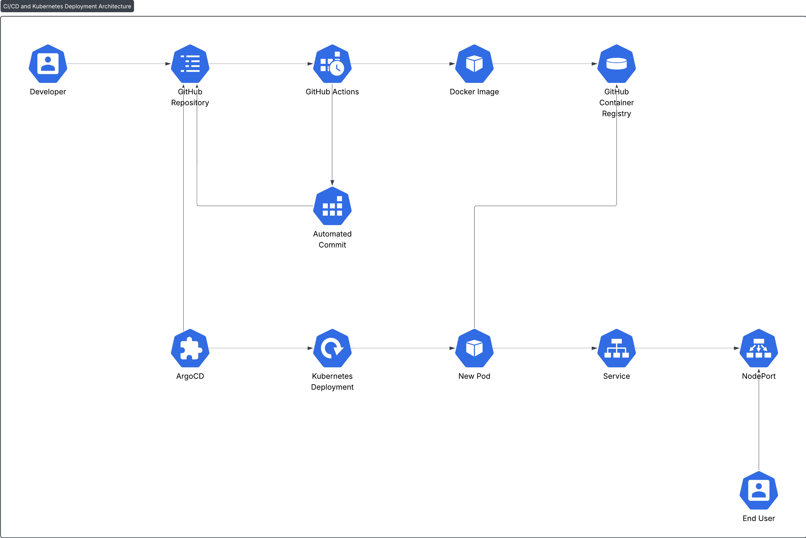
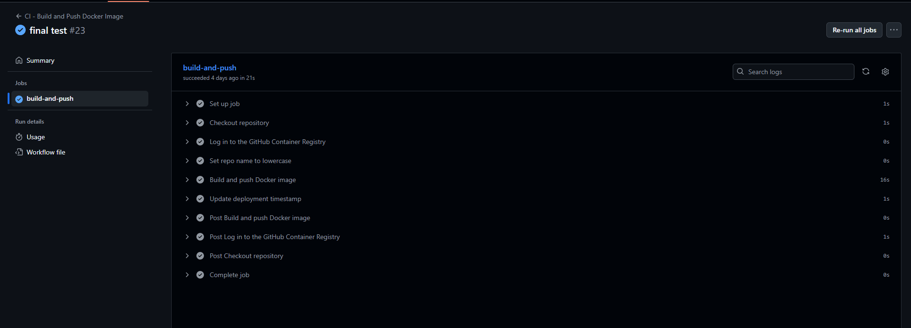
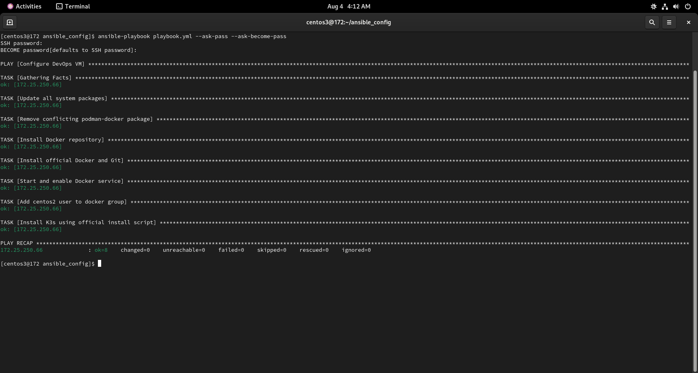
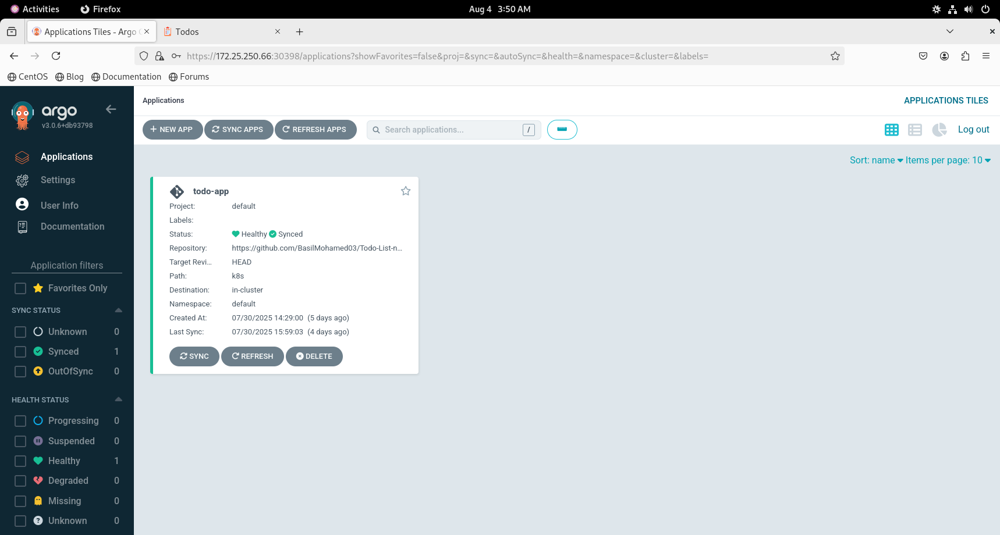
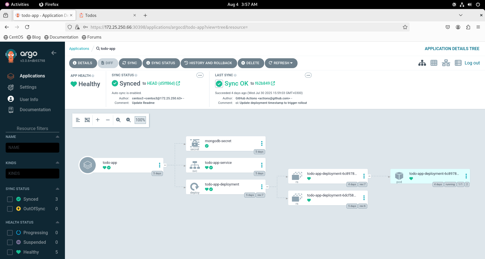
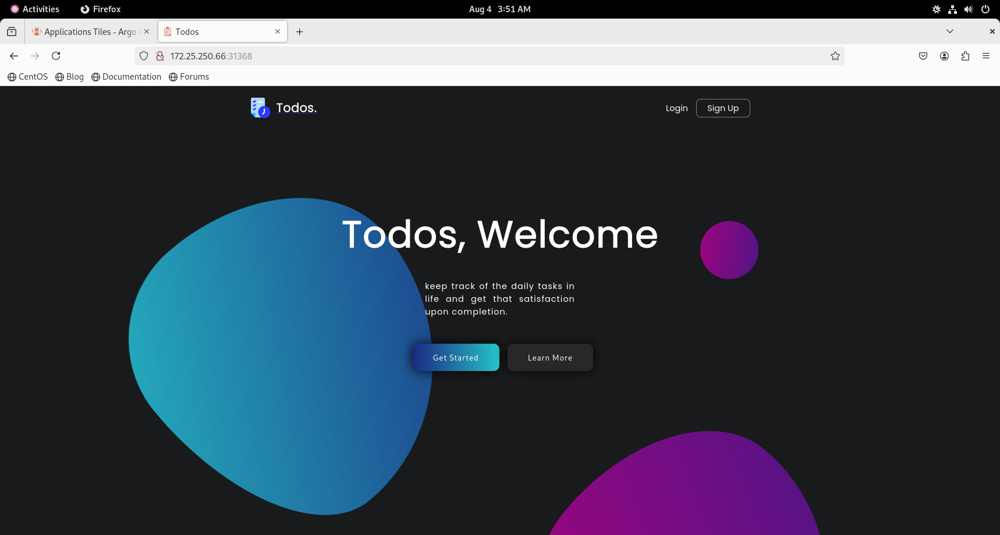

# CI/CD with Kubernetes and ArgoCD
This project demonstrates a full CI/CD pipeline for a Node.js To-Do List application, deploying it to a Kubernetes cluster using GitOps principles with ArgoCD, (This project is part of Fortstak Assessment).

## Table of Contents
1. Project Overview
2. Architecture
3. Assumptions and Key Decisions
4. Building The App:

   * **Part 1:** CI Pipeline with GitHub Actions

   * **Part 2:** VM Configuration with Ansible

   * **Part 3 & 4:** Kubernetes & ArgoCD Deployment
5. Accessing the Application
6. Troubleshooting Journey

## 1. Project Overview
This project automates the deployment of a Node.js To-Do List application. The key objectives achieved are:

**Continuous Integration (CI):** Automatically build a Docker image of the application on every push to the `master` branch and push it to a private container registry (GHCR).

**Configuration Management:** Use Ansible to automatically provision a virtual machine with all necessary dependencies like Docker and Kubernetes.

**Continuous Deployment (CD):** Use ArgoCD to monitor the container registry for new images and automatically deploy the latest version to a Kubernetes cluster, following GitOps best practices.

### Technologies Used
* **Application:** Node.js, MongoDB

* **Containerization:** Docker

* **CI/CD:** GitHub Actions, ArgoCD

* **Configuration Management:** Ansible

* **Orchestration:** Kubernetes (K3s)

* **Virtualization:** VMware Workstation

## Architecture
The workflow follows a modern GitOps pipeline:

* **Developer Push:** A developer pushes a code change to the `master` branch on GitHub.

* **CI Pipeline Trigger:** The push automatically triggers the GitHub Actions workflow.

* **Build & Push:** The workflow builds a new Docker image and pushes it to the GitHub Container Registry (GHCR) with two tags: the unique commit `SHA `and `latest`.

* **ArgoCD Image Updater:** The ArgoCD Image Updater, running in the cluster, detects the new image in GHCR.

* **Git Commit:** The Image Updater automatically commits a change to the `deployment.yml` file in the Git repository, updating the image tag to the new version.

* **ArgoCD Sync:** ArgoCD detects that the live state in the cluster no longer matches the desired state in the Git repository.

* **Deployment:** ArgoCD automatically syncs the application, pulling the new image and rolling out the update to the Kubernetes cluster.



## Assumptions and Key Decisions
* **Choice of Environment:** Local VM over AWS Cloud
The initial plan was to use an AWS EC2 `t2.micro` instance from the free tier. However, this approach was abandoned due to severe performance limitations.

* **Justification:** The `t2.micro` instance, with its limited 1 vCPU and 1 GiB of RAM, proved insufficient to run a Kubernetes cluster (even the lightweight K3s) and the ArgoCD application simultaneously. The instance repeatedly became unresponsive, leading to installation timeouts and connection failures.

* To successfully complete the assessment, a more powerful and stable environment was necessary. As per the guidelines allowing the use of a local machine, the project was pivoted to a local CentOS 9 VM running on VMware. This provided the required resources (2+ vCPUs, 2GB+ RAM) to run the full Kubernetes and ArgoCD stack reliably, allowing for the successful demonstration of all required DevOps skills without being hindered by hardware constraints.

## Building The App:
### Part 1: CI Pipeline with GitHub Actions
This section covers the containerization of the application and the setup of the CI workflow.

* **Fork and Clone:** The repository `Ankit6098/Todo-List-nodejs` was forked and cloned locally.

* **MongoDB Setup:** A free `M0` cluster was created on MongoDB Atlas to serve as the application's database.

* **Dockerization:** A multi-stage `Dockerfile` was created to build a small, efficient production image.

* **GitHub Actions Workflow:** A CI workflow was created at `.github/workflows/ci.yml`.

* **Trigger:** The workflow runs on every push to the `master` branch.

* **Lowercase Tags:** A step was added to convert the repository name to lowercase, as required by container registries.

* **Build and Push:** The workflow builds the Docker image and pushes it to GHCR with both a unique commit `SHA` tag and a `latest` tag.

* **Required Secrets** The following secrets must be configured in the GitHub repository at `Settings` > `Secrets` and `variables` > `Actions`.
* **GH_PAT:** A GitHub Personal Access Token with `write:` Packages scope to allow pushing images to GHCR.



### Part 2: VM Configuration with Ansible
Ansible was used to automate the setup of a local CentOS 9 VM.

1.  **VM Creation**
   A local VM was created using VMware with the following specifications:

   * **OS:** CentOS 9 Stream

   * **CPU:** 2 Cores

   * **RAM:** 2 GB

   * **Network:** NAT

2. **Ansible Playbook**
  * An Ansible playbook `ansible_config/playbook.yml` was created to perform the following tasks:

  * Install necessary dependencies (git).

  * Install Docker and configure it to run as a service.

  * Add the user to the docker group.

  * Install a lightweight Kubernetes distribution (K3s) and its required SELinux policy.

        

### Part 3 & 4: Kubernetes & ArgoCD Deployment
Deploying the application to a K3s cluster using ArgoCD.

1. **Kubernetes Manifests**
     A k8s directory was created to hold the Kubernetes configuration files:
      * **secret.yml:** Manages the MongoDB connection string as a Kubernetes secret.
      * **deployment.yml:** Defines how to run the application, including health checks, resource requests, and the imagePullSecrets    needed to pull from a private registry.
      * **service.yml:** Exposes the application to the network using a NodePort.

2. **ArgoCD Installation**
      * The full, standard version of ArgoCD was installed on the K3s cluster.
      * The ArgoCD Image Updater was also installed to enable the automated deployment workflow.
3. **ArgoCD Configuration**
      * A Kubernetes secret `image-updater-secret` was created containing a GitHub PAT with repo scope. This allows the image updater to commit changes back to the Git repository.
      * The ArgoCD UI was exposed via a NodePort for easy access.

4. **Application Deployment**
      * A new application was created in the ArgoCD UI, pointing to this Git repository.
      * ArgoCD automatically synced the manifests and deployed the application.

      

      
## Accessing the Application
* **access the deployed To-Do List application:**

    Find the application's port by running this command on the VM: 
```bash
     sudo k3s kubectl get svc todo-app-service -n default
  ```               
   * Look for the NodePort number (e.g., 80:3xxxx/TCP).
   * Open your browser and navigate to: http://<YOUR_VM_IP>:<NODE_PORT>

     
## Troubleshooting Journey
Several challenges were encountered and overcome during this assessment, demonstrating key debugging skills:

* **Cloud vs. Local:** The initial choice of an AWS t2.micro instance was abandoned due to resource exhaustion, leading to a successful pivot to a more powerful local VM.

* **Ansible Connectivity:** Initial connection issues were resolved by correcting the remote username (centos2), fixing the playbook to handle package conflicts (podman-docker), and ensuring the correct installation method for K3s on CentOS 9.

* **Image Naming:** The CI pipeline was failing due to uppercase letters in the GitHub username. This was fixed by adding a step to lowercase the repository name before tagging the image.

* **Image Not Found:** The `ImagePullBackOff` error was traced back to a CI pipeline that was not successfully pushing the image. The root cause was identified as incorrect repository permissions (Read only instead of Read and write) for GitHub Actions.

* **Application Health Checks:** The final connection refused error was debugged by checking the application logs, which revealed the app was running on port `4000` while the Kubernetes probes were checking port `8000`. Aligning the ports in the manifests resolved the issue.